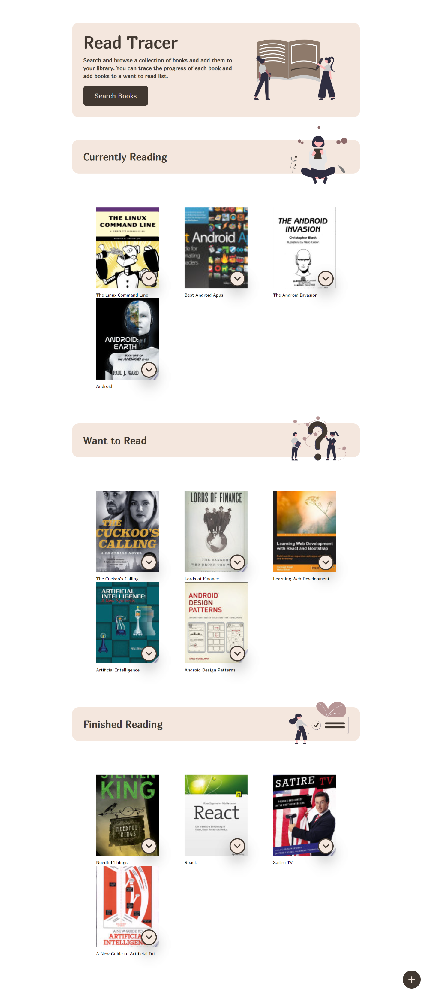
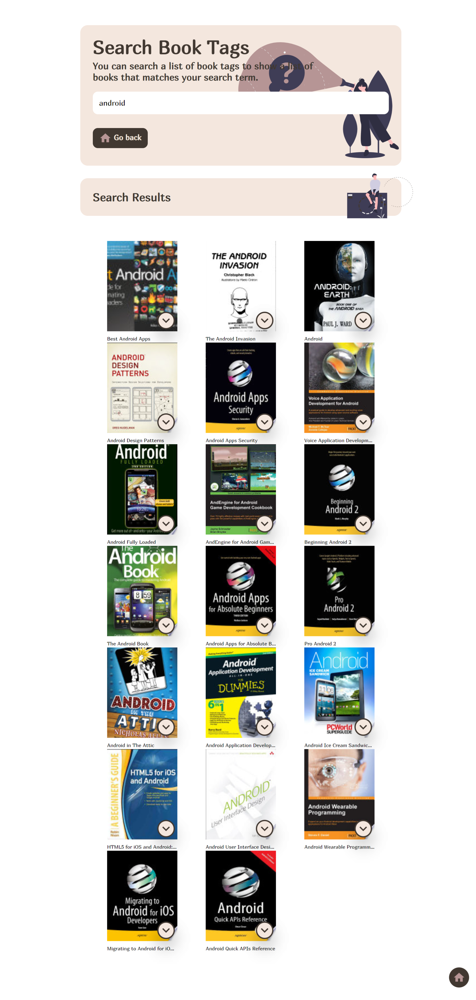

<!-- PROJECT LOGO -->
<br />
<p align="center">
  <a href="https://omardev.me/">
    
  </a>

  <h2 align="center">Read Tracker</h2>

  <p align="center">
    Search and browse a collection of books and add them to your library. You can trace the progress of each book and add books to a want to read list.
    <br />
    <br />
    <a href="https://omardev.me/"> <strong>View Project</strong></a>
    ·
    <a href="https://github.com/omar-labana/portfolio/issues">Report Bug</a>
    ·
    <a href="https://github.com/omar-labana/portfolio/issues">Request Feature</a>
  </p>
</p>

<!-- TABLE OF CONTENTS -->
<details open="open">
  <summary>Table of Contents</summary>
  <ol>
    <li>
      <a href="#about-the-project">About The Project</a>
      <ul>
        <li><a href="#built-with">Built With</a></li>
      </ul>
    </li>
    <li>
      <a href="#getting-started">Getting Started</a>
      <ul>
        <li><a href="#prerequisites">Prerequisites</a></li>
        <li><a href="#installation">Installation</a></li>
      </ul>
    </li>
    <li><a href="#usage">Usage</a></li>
    <li><a href="#contributing">Contributing</a></li>
    <li><a href="#license">License</a></li>
    <li><a href="#contact">Contact</a></li>
  </ol>
</details>

<!-- ABOUT THE PROJECT -->

## About The Project

<span style="display: flex; justify-content: space-around;">


</span>


Here's what you can find:

- Info about me and what I do.
- Projects I built and the tech stack used in each one.
- Programming languages, frameworks, and tools that I use.

### Built With

- [Vite](https://vitejs.dev/)
- [Vue.js](https://vuejs.org/)
- [Tailwind CSS](https://tailwindcss.com/)
- [Headless UI](https://headlessui.dev/)

<!-- GETTING STARTED -->

## Getting Started

To get a local copy up and running follow these simple example steps.

### Prerequisites

- Node.js & npm installed.
- Git and any terminal to run commands.

### Installation

1. Clone the repo
   ```sh
   git clone https://github.com/omar-labana/read-track.git
   ```
2. Install NPM packages
   ```sh
   npm install
   ```

<!-- USAGE EXAMPLES -->

## Usage

1. Run the dev server
   ```sh
   npm run dev | npm run start
   ```
2. Open http://localhost:3000/ in your browser
3. Start tracking books!
<!-- ROADMAP -->

## Contributing

Contributions are what makes the open source community such an amazing place to learn, inspire, and create. Any contributions you make are **greatly appreciated**.

1. Fork the Project
2. Create your Feature Branch (`git checkout -b feature/AmazingFeature`)
3. Commit your Changes (`git commit -m 'Add some AmazingFeature'`)
4. Push to the Branch (`git push origin feature/AmazingFeature`)
5. Open a Pull Request

<!-- LICENSE -->

## License

Distributed under the MIT License. See `LICENSE` for more information.

<!-- CONTACT -->

## Contact

Omar - [@panda4cs](https://twitter.com/dev_ramo) - omarlabana@outlook.com
